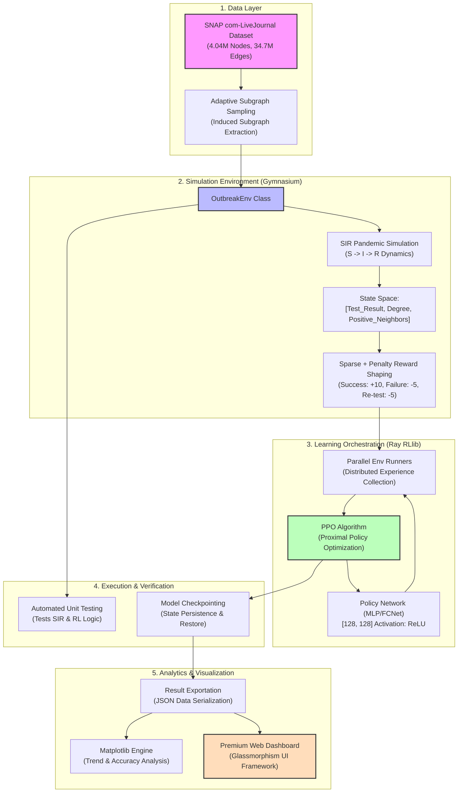

# RL Outbreak Detective: System Architecture

This document provides a professional, technical architecture diagram and description for the **RL Outbreak Detective** project. This is suitable for inclusion in research papers and technical documentation.

## 🏗️ System Architecture Overview

The system follows a modular pipeline architecture, separating data management, environmental simulation, reinforcement learning orchestration, and the analytical front-end.

## 📝 Component Descriptions

### 1. Data Layer
The system utilizes the **SNAP com-LiveJournal** network, representing a high-scale social community. To ensure computational efficiency and session stability, an **Induced Subgraph Sampling** method is used to extract 50,000 node subgraphs for training and evaluation while maintaining the original network's topological properties.

### 2. Simulation Environment
Built on the **OpenAI Gymnasium API**, the environment simulates a pandemic outbreak using an **SIR model**. It provides a 3-feature observation space for each node: current test status, node degree, and a "neighbor knowledge" feature tracking positive tests in the adjacency set.

### 3. Learning Orchestration
Leveraging **Ray RLlib**, the system implements **Proximal Policy Optimization (PPO)**. It utilizes parallel environment runners to collect experience across distributed workers (optimized for local CPU/GPU resources). The policy network is a classic Fully Connected Network (FCNet) with two 128-neuron layers.

### 4. Verification & Validation
A rigorous testing suite ensures **SIR Conservation** (S+I+R = N) and validates the multi-objective reward structure. Model checkpoints are saved in standard RLlib format, allowing for **Incremental Learning** where the agent can resume training across different sessions.

### 5. Analytics & Visualization
The final outputs include publication-quality charts (Training Curves, Accuracy Benchmarks) and a state-of-the-art **Glassmorphism Dashboard**. The UI uses a client-side fetch architecture to visualize agent decision-making and baseline comparison results in real-time.
